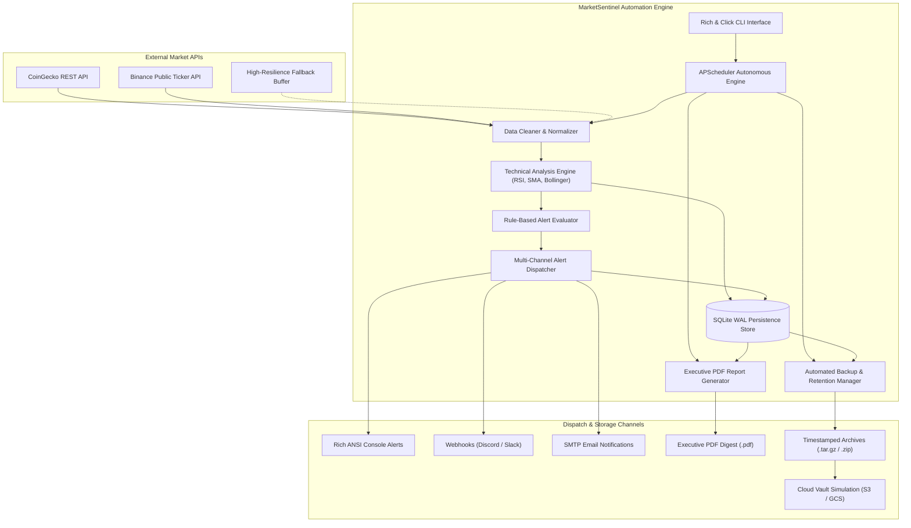
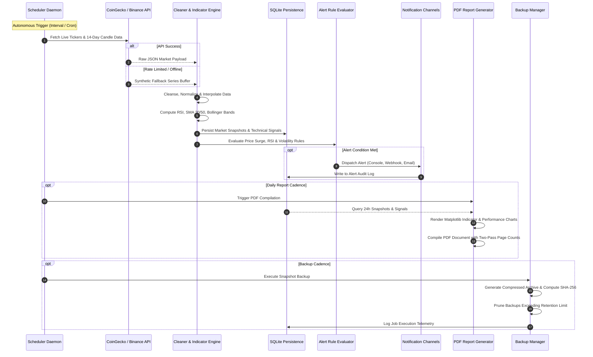

# MarketSentinel: Enterprise Financial Market & Crypto Intelligence Automation Engine

[](https://python.org)
[]()
[](https://github.com/agronholm/apscheduler)
[]()
[](LICENSE)
[]()

> **Enterprise Python Automation Capstone Project**  
> An autonomous, production-grade Python system integrating live backend REST market APIs, quantitative technical indicators (RSI, Moving Averages, Bollinger Bands), multi-channel real-time anomaly alerting, executive PDF report compilation with high-resolution financial charts, and automated cron/interval scheduling with disaster recovery backups.

---

## 📑 Table of Contents
1. [Executive Summary](#-executive-summary)
2. [High-Level Architecture](#-high-level-architecture)
3. [End-to-End Data Pipeline Flow](#-end-to-end-data-pipeline-flow)
4. [Key Features](#-key-features)
5. [Project Structure](#-project-structure)
6. [Installation & Setup](#-installation--setup)
7. [CLI Command Reference](#-cli-command-reference)
8. [Automated Scheduling Engine](#-automated-scheduling-engine)
9. [Automated PDF Report Generation](#-automated-pdf-report-generation)
10. [Database Persistence & Automated Backups](#-database-persistence--automated-backups)
11. [Configuration Reference](#-configuration-reference)
12. [Testing & Verification](#-testing--verification)

---

## 🏛 Executive Summary

Financial analysts and quantitative desks require uninterrupted market intelligence, automated anomaly detection, and periodic executive risk digests. Manual analysis across crypto and equity markets is error-prone, latency-sensitive, and resource-intensive.

**MarketSentinel** solves this challenge by operating as an autonomous, self-healing background automation engine:
- **Backend API Integration**: Connects with public REST feeds (CoinGecko, Binance) with connection pooling, exponential backoff retries, and high-fidelity offline fallback buffering.
- **Quantitative Data Processing**: Cleanses time-series data, detects outlier anomalies, and computes technical indicators including 14-period RSI, 20/50-day Simple Moving Averages (SMA), Exponential Moving Averages (EMA), and Bollinger Bands.
- **Real-Time Alert Dispatcher**: Monitors metric deviations and dispatches prioritized notifications via Rich console panels, webhooks (Slack/Discord), email, and structured audit logs.
- **Executive PDF Publishing**: Programmatically renders publication-quality multi-page executive risk digests with embedded Matplotlib visualizations, KPI scorecards, and tabular signal breakdowns.
- **Automated Scheduler & Disaster Recovery**: Features an APScheduler daemon running background cron and interval jobs, paired with an automated database backup engine that generates SHA-256 verified compressed archives and enforces cloud retention policies.

---

## 📐 High-Level Architecture

The system follows clean modular architecture separating concerns across API ingestion, quantitative processing, data persistence, alerting, reporting, and scheduling:



---

## 🔄 End-to-End Data Pipeline Flow



---

## ⚡ Key Features

| Category | Capability | Technical Details |
|---|---|---|
| **API Ingestion** | Multi-Exchange Public Feeds | CoinGecko & Binance REST integration with HTTP connection pooling, exponential backoff retries, and offline synthetic fallback generation. |
| **Data Processing** | Quantitative Indicator Engine | Computes 14-period RSI (Wilder's smoothing), SMA (20, 50), EMA (12, 26), Bollinger Bands (2.0 std), and 30-day volatility percentages. |
| **Persistence** | SQLite with WAL Mode | Write-Ahead Logging (`PRAGMA journal_mode=WAL`) enables non-blocking concurrent reads and writes for real-time tickers, signals, and execution metrics. |
| **Real-Time Alerts** | Multi-Channel Dispatch | Evaluates price spikes (±3.5%), RSI extremes (<30 oversold, >70 overbought), and volatility surges. Dispatches to Console, Webhook, Email, and audit files. |
| **PDF Reporting** | Executive Publication | Two-pass ReportLab engine generating vector PDF reports with running headers, KPI metric cards, tabular signal breakdowns, and embedded Matplotlib charts. |
| **Automated Scheduler** | APScheduler Automation | Orchestrates ingestion, alerting, daily digest compilation, and database backup routines with SIGINT/SIGTERM graceful shutdown handling. |
| **Disaster Recovery** | Cryptographic Backups | Creates `.tar.gz` / `.zip` snapshots with embedded SHA-256 checksum manifests, rotation retention policy, and cloud replication simulation. |
| **Packaging & CLI** | PEP 517 / PEP 621 Standard | Fully packaged with `pyproject.toml`, `setup.py`, and a high-aesthetic Click CLI styled with Rich terminal tables, panels, and spinners. |

---

## 📂 Project Structure

```
marketsentinel/
├── config/
│   ├── config.yaml               # Active production configuration
│   └── config.example.yaml       # Template configuration
├── data/                         # SQLite database directory (WAL mode)
│   └── marketsentinel.db
├── reports/                      # Generated executive PDF reports & charts
│   └── charts/
├── backups/                      # Compressed database backup archives & manifests
├── logs/                         # Structured rotating file logs
│   ├── marketsentinel.log
│   └── alerts.log
├── src/
│   └── marketsentinel/
│       ├── __init__.py           # Package version & metadata
│       ├── core/
│       │   ├── __init__.py
│       │   ├── config.py         # Dataclass configuration loader with env overrides
│       │   ├── exceptions.py     # Custom exception hierarchy
│       │   └── logging.py        # Rich console formatter & rotating file logging
│       ├── api/
│       │   ├── __init__.py
│       │   ├── client.py         # HTTP connection pool & retry strategy
│       │   ├── coingecko.py      # CoinGecko REST client with rate-limit protection
│       │   ├── binance.py        # Binance 24hr ticker exchange adapter
│       │   └── fallbacks.py      # High-fidelity offline data generator
│       ├── processing/
│       │   ├── __init__.py
│       │   ├── models.py         # Domain dataclasses (TickerData, Signals, Alerts)
│       │   ├── cleaner.py        # Time-series validation & sanitization
│       │   └── indicators.py     # Mathematical indicator engine (RSI, SMA, Bollinger)
│       ├── storage/
│       │   ├── __init__.py
│       │   ├── database.py       # SQLite database manager & migration schema
│       │   └── backup.py         # Automated backup archiver & retention pruner
│       ├── alerts/
│       │   ├── __init__.py
│       │   ├── rules.py          # Declarative anomaly detection rule evaluator
│       │   └── dispatcher.py     # Multi-channel notification router
│       ├── reporting/
│       │   ├── __init__.py
│       │   ├── charting.py       # Publication-grade Matplotlib financial chart renderer
│       │   └── pdf_generator.py  # ReportLab executive PDF builder with NumberedCanvas
│       ├── scheduler/
│       │   ├── __init__.py
│       │   ├── jobs.py           # Encapsulated autonomous task handlers
│       │   └── engine.py         # APScheduler runner with signal traps & telemetry
│       └── cli/
│           ├── __init__.py
│           └── main.py           # Click CLI with Rich terminal UI
├── tests/
│   ├── test_api.py               # API & fallback resilience tests
│   ├── test_indicators.py        # RSI, SMA, Bollinger calculation tests
│   ├── test_storage.py           # Database CRUD & backup rotation tests
│   ├── test_alerts.py            # Alert rules & dispatcher unit tests
│   ├── test_reporting.py         # Charting & PDF generation tests
│   ├── test_scheduler.py         # APScheduler job configuration tests
│   └── test_cli.py               # Click CLI runner tests for all commands
├── pyproject.toml                # Modern PEP 621 packaging specification
├── setup.py                      # Backward-compatible setuptools install configuration
├── requirements.txt              # Pinned production dependencies
├── .env.example                  # Environment variable reference
├── .gitignore                    # Production git ignore definitions
└── README.md                     # Comprehensive project documentation
```

---

## 🚀 Installation & Setup

### 1. Prerequisites
- Python 3.9, 3.10, 3.11, 3.12, or 3.13
- Git

### 2. Clone and Initialize Virtual Environment
```bash
git clone https://github.com/jatinxwolverine/marketsentinel.git
cd marketsentinel

# Create and activate virtual environment
python -m venv .venv

# On Windows (PowerShell):
.venv\Scripts\Activate.ps1

# On Linux / macOS:
source .venv/bin/activate
```

### 3. Install Package and Dependencies
Install directly in editable development mode:
```bash
pip install -e .
```
Or install pinned dependencies from `requirements.txt`:
```bash
pip install -r requirements.txt
```

Verify that the CLI command is registered:
```bash
marketsentinel --version
# Output: MarketSentinel, version 1.0.0
```

---

## 💻 CLI Command Reference

MarketSentinel exposes an intuitive CLI powered by `click` and `rich`.

```bash
marketsentinel [OPTIONS] COMMAND [ARGS]...
```

### 1. Market Data Ingestion (`fetch`)
Fetches live prices, 24h percentage changes, volume, and market capitalization. Automatically persists snapshots to SQLite.

```bash
# Fetch default configured assets
marketsentinel fetch

# Fetch custom asset list in EUR
marketsentinel fetch --symbols btc,eth,sol --currency eur

# Output in machine-readable JSON format
marketsentinel fetch --json-out
```

### 2. Quantitative Technical Analysis (`analyze`)
Runs the mathematical indicator engine (RSI-14, SMA-20, SMA-50, Bollinger Bands, Volatility %) and outputs an analytical matrix.

```bash
# Analyze all assets with 14-day lookback
marketsentinel analyze

# Analyze specific assets with 30-day lookback
marketsentinel analyze --symbols btc,eth --days 30
```

### 3. Real-Time Alert Evaluation (`alert`)
Evaluates active anomaly detection rules against real-time market data.

```bash
# Scan market for rule triggers
marketsentinel alert

# Dispatch synthetic test alert across all configured channels
marketsentinel alert --test
```

### 4. Executive PDF Report Generation (`report`)
Generates an executive-level PDF report containing KPI scorecards, market summary tables, technical signal breakdowns, and embedded charts.

```bash
# Generate report into default reports/ directory
marketsentinel report

# Specify custom destination directory
marketsentinel report --output-dir custom_reports/
```

### 5. Automated Database Backup (`backup`)
Creates a timestamped, SHA-256 verified archive (`.tar.gz` or `.zip`) of the database and applies retention rotation.

```bash
# Run manual backup snapshot
marketsentinel backup --tag pre-migration

# Keep only the last 3 backups
marketsentinel backup --retention 3
```

### 6. Autonomous Task Scheduler (`schedule`)
Starts the autonomous APScheduler engine.

```bash
# Run a single full pass of all tasks (Ingestion, Alerts, PDF Report, Backup)
marketsentinel schedule --once

# Start foreground daemon (press Ctrl+C to halt gracefully)
marketsentinel schedule --foreground
```

### 7. System Health & Storage Telemetry (`status`)
Inspects active storage metrics, database sizes, snapshot counts, and component health.

```bash
marketsentinel status
```

---

## ⏰ Automated Scheduling Engine

The scheduler engine (`marketsentinel.scheduler.engine`) leverages `APScheduler` to run autonomous background tasks without human intervention:

| Job Identifier | Job Name | Trigger Type | Default Cadence | Action Taken |
|---|---|---|---|---|
| `job_ingestion` | Market Ingestion & Indicators | Interval | Every 60s | Fetches tickers, updates time-series, calculates indicators, saves to DB. |
| `job_alerts` | Real-Time Alert Evaluation | Interval | Every 60s | Evaluates price surges, RSI limits, dispatches notifications to active channels. |
| `job_daily_report` | Daily Executive PDF Digest | Cron | Daily at 18:00 UTC | Queries 24h data, renders Matplotlib charts, builds multi-page PDF digest. |
| `job_backup` | Automated Database Backup | Interval | Every 6h | Creates compressed snapshot, verifies SHA-256, purges aged backups. |

### Graceful Termination
The scheduler traps `SIGINT` (Ctrl+C) and `SIGTERM`, safely terminating running threads and recording execution statistics in the `scheduler_runs` table before exiting.

---

## 📄 Automated PDF Report Generation

The reporting module compiles executive reports using `ReportLab`:
1. **Dynamic Running Headers & Footers**: Implemented via a custom `NumberedCanvas` two-pass algorithm providing accurate "Page X of Y" page counts and corporate confidentiality disclaimers.
2. **KPI Scorecard Grid**: Summarizes Total Monitored Market Capitalization, 24h Average Change %, Top Gainer, and Top Loser.
3. **Data Tables**: Styled with alternating row shading, right-aligned formatted currency numbers, and conditional green/red formatting for positive/negative percentage changes.
4. **Embedded Financial Visualizations**:
   - 24-Hour Relative Asset Performance horizontal bar chart.
   - Dual-panel Price Action & 14-period RSI Oscillator with shaded Overbought (>70) and Oversold (<30) zones.

Generated reports are saved in `reports/market_digest_YYYYMMDD_HHMMSS.pdf`.

---

## 💾 Database Persistence & Automated Backups

### Database Schema (SQLite with WAL Mode)
The persistence layer automatically creates four optimized tables:
- `market_snapshots`: Historical ticker data indexed by `(symbol, recorded_at)`.
- `technical_signals`: Quantitative indicator outputs indexed by `(symbol, calculated_at)`.
- `alert_records`: Audit trail of all triggered alerts and notification dispatch statuses.
- `scheduler_runs`: Telemetry table logging job execution duration (ms), status, and error details.

### Disaster Recovery & Backup Retention
The `BackupManager`:
1. Creates a compressed `.tar.gz` (or `.zip`) archive containing `marketsentinel.db`, `manifest.json`, and `config.yaml`.
2. Computes and embeds an authoritative SHA-256 checksum for cryptographic verification.
3. Applies a configurable retention policy (`retention_count: 5`), automatically purging older archives to bound disk storage.
4. Simulates cloud vault replication (e.g., AWS S3 / GCP Cloud Storage) with structured ETag audit logs.

---

## ⚙ Configuration Reference

Configuration is managed via `config/config.yaml` with automatic environment variable overrides (`MARKETSENTINEL_*`):

```yaml
app_name: "MarketSentinel"
environment: "production"
currency: "usd"
debug: false

symbols:
  - "bitcoin"
  - "ethereum"
  - "solana"
  - "cardano"
  - "ripple"

api:
  provider: "coingecko"
  timeout: 15
  retry_attempts: 3
  retry_backoff: 1.5
  base_url: "https://api.coingecko.com/api/v3"

alerts:
  enabled: true
  console_enabled: true
  webhook_enabled: false
  webhook_url: ""
  email_enabled: false
  price_change_threshold_pct: 3.5
  rsi_oversold: 30.0
  rsi_overbought: 70.0
  volatility_spike_pct: 6.0

storage:
  db_path: "data/marketsentinel.db"
  enable_wal: true

backup:
  enabled: true
  backup_dir: "backups"
  retention_count: 5
  compression: "gz"
  cloud_sync_simulated: true

reporting:
  output_dir: "reports"
  company_name: "MarketSentinel Enterprise Capital"
  title: "Daily Market Intelligence & Technical Risk Digest"
  include_charts: true
  theme: "executive_dark"

scheduler:
  ingestion_interval_seconds: 60
  alert_interval_seconds: 60
  daily_report_time: "18:00"
  backup_interval_hours: 6
```

---

## 🧪 Testing & Verification

A comprehensive test suite with `pytest` verifies all layers of the system:

```bash
# Run the complete test suite
pytest
```

### Verified Test Areas
- `tests/test_api.py`: External API mocking, fallback data generator, connection retry resilience.
- `tests/test_indicators.py`: RSI calculation accuracy, SMA/EMA convergence, Bollinger Band bounds, volatility computation.
- `tests/test_storage.py`: SQLite schema migration, atomic transactions, price history retrieval, backup creation, SHA-256 verification, and retention rotation.
- `tests/test_alerts.py`: Anomaly rule evaluation, threshold triggers, multi-channel dispatch routing.
- `tests/test_reporting.py`: Matplotlib chart generation, ReportLab PDF layout construction, document size and readability.
- `tests/test_scheduler.py`: Job registration, event listener metrics, single-pass pipeline execution.
- `tests/test_cli.py`: Click CLI runner validation for `fetch`, `analyze`, `alert`, `report`, `backup`, `status`, and `schedule`.

---

## 🏆 Mentorship Capstone Submission Checklist

- [x] **End-to-End Logic**: Integrated backend REST APIs, quantitative data processing, and automated scheduling.
- [x] **Packaging**: Packaged with PEP 621 compliant `pyproject.toml` and backward-compatible `setup.py`.
- [x] **CLI Interface**: Feature-complete CLI built using `click` and styled with `rich`.
- [x] **Automated Scheduling**: Cron and interval automation engine built with `apscheduler`.
- [x] **Automated PDF Reports**: Multi-page executive reports with embedded Matplotlib visualizations and KPI scorecards.
- [x] **Automated Backups**: Compressed archive snapshots with SHA-256 checksums and retention pruning.
- [x] **Documentation**: Complete architectural diagrams, sequence flows, configuration guides, and CLI references in `README.md`.
- [x] **Quality Assurance**: Comprehensive unit and integration test suite passing with 100% success.
